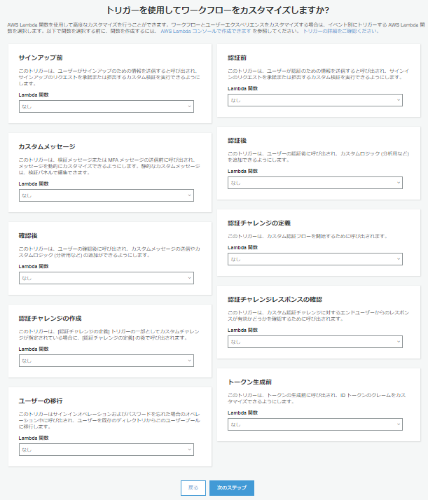

# AWS cognitoによる認可サーバーの構築手順

## 構築に必要なもの

- AWSアカウント

- AWS EC2 Amazon Linux (npm, nodeコマンドが使用可能であること)

    ※ Lambdaでnodejsを使用する場合、Amazon Linux環境でビルドする必要があるため

    ※ テスト用に用意したソースファイルがあるため、nodejsのモジュールを追加しないのであれば、EC2は不要。（テスト用には「mysql」と「bcrypt」モジュールのみ追加済み）

- AWS Lambda

    ※ ユーザーにパスワードの変更を要求せずに、既存アカウントデータを外部DBから移行する場合必要

- AWS Cognito ユーザープール

- AWS API Gateway

    ※ id tokenの解析APIを構築する場合必要。
    ※ CognitoのUserInfoエンドポイント(OAuth2)を使用してユーザー情報を渡す場合は不要。

## 構築手順

### cognitoユーザープールの構築

1. AWS マネジメントコンソールからcognitoサービスにアクセスする

1. 【ユーザープールの管理】を選択

1. 【ユーザープールを作成する】を選択

1. 【プール名】に任意の名前を入力し、【ステップに従って設定する】を選択

1. 環境に合わせて項目を設定

    

    ※ 【エンドユーザーをどのようにサインインさせますか?】（サインイン時に必要な項目の設定）と【どの標準属性が必要ですか?】（新規登録時の必須項目）は後から変更できない

    

    

    

    

    

    

    ※ アプリクライアントは後から追加する

    

    ※ ワークフローのカスタマイズは後から設定する

    

1. 左メニューの【全般設定】>【ユーザーとグループ】を選択

1. 【ユーザーの作成】を選択

1. 各項目を入力し、テストユーザーを作成する

    

1. 左メニューの【全般設定】>【アプリクライアント】を選択

1. 【アプリクライアントの追加】を選択

1. 各項目を入力し、テスト用のアプリクライアントを作成する

    

1. 左メニューの【アプリの統合】>【アプリクライアントの設定】を選択

1. 各項目を入力し、【変更の保存】を選択

    

    ※ アプリクライアントに[name]の属性も渡す場合は【profile】にチェックが必要

1. 左メニューの【アプリの統合】>【ドメイン名】を選択

1. 【ドメインのプレフィックス】に使用可能なドメイン名を入力し、【変更の保存】を選択

#### 動作確認

1. 下記URLへアクセスする

    ```
    https://{設定したドメイン名}.auth.us-east-2.amazoncognito.com/login
    ?response_type=code
    &client_id={テスト用アプリクライアントのクライアントID}
    &redirect_uri={アプリクライアントの設定で登録したコールバックURL}
    ```

    例：https://comee-sample.auth.us-east-2.amazoncognito.com/login?response_type=code&client_id=61ocakkq1t8p7nb3lcmd2rl893&redirect_uri=http://localhost/cognito-callback

1. 作成したテストユーザーのメールアドレスとパスワードを入力し、【Sign in】を選択

1. 新しいパスワードとユーザー名を入力し、【Send】を選択

1. URLパラメータに記載されているcodeの値を控える

    `http://localhost/cognito-callback?code=46fba777-3236-4008-b612-05de0a1bc242`

1. コマンドプロンプトから下記コマンドを実行

    ```
    curl https://comee-sample.auth.us-east-2.amazoncognito.com/oauth2/token ^
        -d grant_type=authorization_code ^
        -d code={控えておいたcodeの値} ^
        -d client_id={テスト用アプリクライアントのクライアントID} ^
        -d client_secret={テスト用アプリクライアントのシークレットキー} ^
        -d redirect_uri={アプリクライアントの設定で登録したコールバックURL}
    ```

    例：

    ```
    curl https://comee-sample.auth.us-east-2.amazoncognito.com/oauth2/token ^
        -d grant_type=authorization_code ^
        -d code=61b45204-8046-4de1-a14e-89222c7d3acf ^
        -d client_id=61ocakkq1t8p7nb3lcmd2rl893 ^
        -d client_secret=1ai50al9ul1rivbb9gj1o42h8sjnv9ksr4v1q4ktfeofq0ta7h5a ^
        -d redirect_uri=http://localhost/cognito-callback
    ```

1. [id token解析](https://jwt.io/)に取得したid tokenを貼り付け、【アプリクライアントの設定】の【許可されているOAuthスコープ】で設定したユーザー情報が含まれているか確認する

    ```
    {
        "at_hash": "ISQFSdfXkTDLgCgOXJ10fA",
        "sub": "29d88ca7-a00e-4023-8249-dcc6aa3d34f4",
        "email_verified": true,
        "iss": "https://cognito-idp.us-east-2.amazonaws.com/us-east-2_CZErrRbBU",
        "phone_number_verified": true,
        "cognito:username": "29d88ca7-a00e-4023-8249-dcc6aa3d34f4",
        "aud": "61ocakkq1t8p7nb3lcmd2rl893",
        "event_id": "da865873-78fd-4160-9c15-a20ea10b0609",
        "token_use": "id",
        "auth_time": 1608613263,
        "phone_number": "+81123456789",
        "exp": 1608616863,
        "iat": 1608613263,
        "email": "cognito_sample@test.com"
    }
    ```

#### 参考

- Cognito構築手順

    - https://qiita.com/MCYamamoto/items/fb86294cd6659fc1b7b5

    - https://qiita.com/nannany_tis/items/52d322be4522a2a8f3f9

### ユーザー移行Lambdaの構築

cognitoでのログイン失敗、またはcognitoでのパスワードリセット時のユーザー認証失敗時、既存DBにアカウント登録されているか検証し、登録されていた場合cognitoにユーザー作成するLambda関数を作成する。

1. AWS マネジメントコンソールからLambdaサービスにアクセスする

1. 【関数の作成】を選択

1. 【一から作成】を選択、【関数名】に任意の名前を入力、【ランタイム】を【Node.js】にして【関数の作成】を選択

1. 【関数コード】項目の【アクション】を選択

1. 【.zipファイルをアップロード】を選択

1. EC2 Amazon Linux環境でビルドしたnode_moduleを含むzipファイルを選択

    ※ 下記、Amazon Linux環境でビルドしたzipファイル

    https://github.com/twg-hsato/sso-sample/blob/master/punlic_html/cognito/Lambda.zip

    ※ ローカル環境等でビルドしたnodejsをそのままLambdaにアップロードすると「invalid ELF header」エラーになり、使用できない。Lambdaでnodejsのモジュールを使用する場合は、Amazon Linux環境でインストールしたソースコードが必要。

1. `index.js`の`connectDb`関数に記載されている外部データベース情報を修正

    ```
    function connectDb() {
        var mysql_host = "IPアドレス";
        var mysql_user = "DBユーザー名";
        var mysql_dbname = "DB名";
        var mysql_password = "DBパスワード";
    ```

1. 変更を保存

1. 【デプロイ】を選択

1. 【テスト】を選択

1. 【イベント名】に任意の名前を入力（例：cognitoLoginTest）

1. コード入力欄に下記のjsonを入力し、【作成】を選択

    ```
    { 
        "version": "1",
        "triggerSource": "UserMigration_Authentication",
        "region": "作成したユーザープールのリージョン",
        "userPoolId": "作成したユーザープールのID",
        "userName": "既存DBに作成済みのユーザーのメールアドレス",
        "callerContext":
        { 
            "awsSdkVersion": "aws-sdk-unknown-unknown",
            "clientId": "テスト用アプリクライアントのクライアントID" 
        },
        "request":
        {
            "password": "既存DBに作成済みのユーザーのパスワード",
            "validationData": null,
            "userAttributes": null 
        },
        "response":
        {
            "userAttributes": null,
            "forceAliasCreation": null,
            "finalUserStatus": null,
            "messageAction": null,
            "desiredDeliveryMediums": null
        }
    }
    ```

    例

    ```
    { 
        "version": "1",
        "triggerSource": "UserMigration_Authentication",
        "region": "us-east-2",
        "userPoolId": "us-east-2_CZErrRbBU",
        "userName": "passport-test@test.com",
        "callerContext":
        { 
            "awsSdkVersion": "aws-sdk-unknown-unknown",
            "clientId": "61ocakkq1t8p7nb3lcmd2rl893" 
        },
        "request":
        {
            "password": "password",
            "validationData": null,
            "userAttributes": null 
        },
        "response":
        {
            "userAttributes": null,
            "forceAliasCreation": null,
            "finalUserStatus": null,
            "messageAction": null,
            "desiredDeliveryMediums": null
        }
    }
    ```

1. 【テスト】を選択し、実行結果が「成功」になることを確認

1. 【作成したテスト名】のタブを選択し、【テストイベントの設定】を選択

1. 【新しいテストイベントの作成】を選択

1. 【イベント名】に任意の名前を入力（例：cognitoPasswordResetTest）

1. コード入力欄に下記のjsonを入力し、【作成】を選択

    ```
    { 
        "version": "1",
        "triggerSource": "UserMigration_ForgotPassword",
        "region": "作成したユーザープールのリージョン",
        "userPoolId": "作成したユーザープールのID",
        "userName": "既存DBに作成済みのユーザーのメールアドレス",
        "callerContext":
        { 
            "awsSdkVersion": "aws-sdk-unknown-unknown",
            "clientId": "テスト用アプリクライアントのクライアントID" 
        },
        "request":
        {
            "validationData": null,
            "userAttributes": null 
        },
        "response":
        {
            "userAttributes": null,
            "forceAliasCreation": null,
            "finalUserStatus": null,
            "messageAction": null,
            "desiredDeliveryMediums": null
        }
    }

    ```

    例

    ```
    { 
        "version": "1",
        "triggerSource": "UserMigration_ForgotPassword",
        "region": "us-east-2",
        "userPoolId": "us-east-2_CZErrRbBU",
        "userName": "test2@test.com",
        "callerContext":
        { 
            "awsSdkVersion": "aws-sdk-unknown-unknown",
            "clientId": "61ocakkq1t8p7nb3lcmd2rl893" 
        },
        "request":
        {
            "validationData": null,
            "userAttributes": null 
        },
        "response":
        {
            "userAttributes": null,
            "forceAliasCreation": null,
            "finalUserStatus": null,
            "messageAction": null,
            "desiredDeliveryMediums": null
        }
    }
    ```

1. 【テスト】を選択し、実行結果が「成功」になることを確認

1. ユーザープール管理画面にアクセスし、左メニューの【全般設定】>【トリガー】を選択

1. 【ユーザーの移行】>【Lambda】関数に作成したLambda関数を設定し、【変更の保存】を選択

#### 動作確認

1. 下記URLへアクセスする

    ```
    https://{設定したドメイン名}.auth.us-east-2.amazoncognito.com/login
    ?response_type=code
    &client_id={テスト用アプリクライアントのクライアントID}
    &redirect_uri={アプリクライアントの設定で登録したコールバックURL}
    ```

    例：https://comee-sample.auth.us-east-2.amazoncognito.com/login?response_type=code&client_id=61ocakkq1t8p7nb3lcmd2rl893&redirect_uri=http://localhost/cognito-callback
    
1. 既存DB、cognitoユーザープールに存在しないメールアドレスとパスワードを入力

1. 「UserMigration failed with error Bad Email.」のエラーメッセージが表示されることを確認

1. 既存DBに登録済みかつ、cognitoユーザープールに存在しないユーザーのメールアドレスと間違ったパスワードを入力

1. 「UserMigration failed with error Bad Password.」のエラーメッセージが表示されることを確認

1. 既存DBに登録済みかつ、cognitoユーザープールに存在しないユーザーのメールアドレスと正しいパスワードを入力

1. URLパラメータに記載されているcodeの値を控える

    `http://localhost/cognito-callback?code=c7595456-7083-4219-99c1-cb22c403fa6d`

1. cognitoのユーザープール管理ページにアクセスし、左メニューの【全般設定】>【ユーザーとグループ】を選択

1. 既存DBのアカウントがcognitoに登録されていることを確認

1. コマンドプロンプトから下記コマンドを実行

    ```
    curl https://comee-sample.auth.us-east-2.amazoncognito.com/oauth2/token ^
        -d grant_type=authorization_code ^
        -d code={控えておいたcodeの値} ^
        -d client_id={テスト用アプリクライアントのクライアントID} ^
        -d client_secret={テスト用アプリクライアントのシークレットキー} ^
        -d redirect_uri={アプリクライアントの設定で登録したコールバックURL}
    ```

    例：

    ```
    curl https://comee-sample.auth.us-east-2.amazoncognito.com/oauth2/token ^
        -d grant_type=authorization_code ^
        -d code=b9ab58f8-33a6-4426-adb4-d244e6e49e65 ^
        -d client_id=61ocakkq1t8p7nb3lcmd2rl893 ^
        -d client_secret=1ai50al9ul1rivbb9gj1o42h8sjnv9ksr4v1q4ktfeofq0ta7h5a ^
        -d redirect_uri=http://localhost/cognito-callback
    ```

1. [id token解析](https://jwt.io/)に取得したid tokenを貼り付け、【アプリクライアントの設定】の【許可されているOAuthスコープ】で設定したユーザー情報が含まれているか確認する

    ```
    {
        "at_hash": "vvOEC7WlCY_BiaoTDW35FA",
        "sub": "f2c09c63-db72-4b24-8118-d45dbdfb51a1",
        "aud": "61ocakkq1t8p7nb3lcmd2rl893",
        "email_verified": true,
        "event_id": "458f4ca3-e6f1-4ed4-9fef-9cef81450237",
        "token_use": "id",
        "auth_time": 1608623895,
        "iss": "https://cognito-idp.us-east-2.amazonaws.com/us-east-2_CZErrRbBU",
        "cognito:username": "f2c09c63-db72-4b24-8118-d45dbdfb51a1",
        "exp": 1608627495,
        "iat": 1608623895,
        "email": "murakami@se-sendai.co.jp"
    }
    ```

1. 下記URLにアクセスし、cognitoからログアウトする

    ```
    https://{設定したドメイン名}.auth.us-east-2.amazoncognito.com/logout
    ?&client_id={テスト用アプリクライアントのクライアントID}
    &logout_uri={アプリクライアントの設定で登録したログアウトURL}
    ```

    例：https://comee-sample.auth.us-east-2.amazoncognito.com/logout?client_id=61ocakkq1t8p7nb3lcmd2rl893&logout_uri=http://localhost/logout

#### 参考

- AWS公式ユーザー移行Lambdaトリガーについての記事

    https://docs.aws.amazon.com/ja_jp/cognito/latest/developerguide/user-pool-lambda-migrate-user.html

- Lambdaユーザー移行ソースコードの参考記事

    https://medium.com/@krishankantsinghal/how-to-migrate-your-existing-user-to-amazon-cognito-pool-2a1b1154ff92

- PHPとNodeJsでのハッシュパスワード検証方法の参考記事

    https://www.it-swarm-ja.tech/ja/php/php%E3%81%A8nodejs%E3%81%AE%E9%96%93%E3%81%AEbcrypt%E3%83%8F%E3%83%83%E3%82%B7%E3%83%A5%E3%81%AE%E6%AF%94%E8%BC%83/1048788395/

- Lambdaテストで「invalid ELF header」になった場合の解決方法記事

    https://www.366service.com/jp/qa/29d38aa8a19318ee3966a8b8eff56e50

### id token検証Lambdaの構築

id tokenをデコードしてユーザー情報を取得するLamnda関数を作成する。

※ 構築にはAWS API Gatewayサービスが必要。
※ Cognitoにもともと備わっているUserInfoエンドポイントを使用する場合は不要。（UserInfoエンドポイントはOAuth0、id token検証LambdaはOpenIDConnect）

#### AWS API Gateway 料金形態

- HTTP API

    - 無料利用枠：最大 12 か月間、1 か月あたり 100 万回の API コール
    - ～3億APIコール数／月：1.00USD（米国東部 (オハイオ)リージョン）

    参照：https://aws.amazon.com/jp/api-gateway/pricing/

#### 構築手順

##### ユーザープールの公開鍵を取得

id tokenのデコードに使用する公開鍵を取得する。

1. 下記にアクセスする

    `https://cognito-idp.{リージョン}.amazonaws.com/{プールID}/.well-known/jwks.json`

    例：https://cognito-idp.us-east-2.amazonaws.com/us-east-2_CZErrRbBU/.well-known/jwks.json

1. 表示された公開鍵情報を控える

    例：

    ```
    {
        "keys": [
            {
            "alg": "RS256",
            "e": "AQAB",
            "kid": "i8FnQGsKa+je/kEa5wRLMsJHEEPca266ksFUaIvrAF4=",
            "kty": "RSA",
            "n": "jGQYRTlGN3ejZgpXym26NQsQsDvi47NgjQLYg-R1ie0iKuj_36mjr74FAbsnbM3j9MxJcYsMq3WFfaExghGGnXIJcthMreLlMhrmXNpo4hXDXUUR54M9nsAw0i4Pq85vwvaECfq0gJY2NBu3MXWCTWENju--zaDUSN42X3s5fZ4C3ZOCDmH04mPV0v7vcJauKpeYJC8ppsvNruNTvhrSs0ICYnGpBrtgB1_9B8nqtlest66RiVexBdmlTeTaZderMON65Ll3YEEEty8Ta9XSasriM4qT3eYBOLQEFnm3ErPIYnHTSeakkkdhmj7yHQ5zPzDceQJJvmG65wxlTSr9IQ",
            "use": "sig"
            },
            {
            "alg": "RS256",
            "e": "AQAB",
            "kid": "8/EOhNhLiaSdxiR7J3mjkgvUCTB3GfigBcqTsfA+OUw=",
            "kty": "RSA",
            "n": "sYEijKsjKzqu3VeafGLwCYKGr6WjZi03j4ocEi-rT6TzzEVBcV5_j1stN5yJ3R8F7-015Kq430h5eJTrsEiLR-i288NBwrh3aQSlhcgNo2CnI68pLGfs5tiIJgr94eBd3XsFvvTLrdHvfr2xU_qZ8AZqVj3U-8NKx0mTgH3OxyXPkgzTBcDXnAKBXvcjMKaXhskKb5px2xWclwjysBVLaRyDl8WqRlrIFACCLKYkEU0n3XO36irjY2lxHXLvsE0YU9O-Zkg1iXwM1CaS4qqyNLN-39DbEre1ELboT1PnTXpfEXhmChXxO4cBeL_Fy1JXGQXdOAlqk1KgwCgzJ7wRtQ",
            "use": "sig"
            }
        ]
    }
    ```

##### Lambdaの構築

id tokenを検証し、デコードした情報を返却するLambda関数を作成する。

1. AWS Lambdaページにアクセスする

1. 【関数の作成】を選択

1. 以下の設定にし、【関数の作成】を選択

    - 方法：一から作成

    - 関数名：任意

    - ランタイム：Node.js

1. 【関数コード】項目の【アクション】を選択

1. Aamazon Linux環境でビルドしたnode-moduleを含むソースコードのzipファイルをアップロード

    https://github.com/twg-hsato/sso-sample/blob/master/punlic_html/cognito/tokenLambda.zip

1. `jwks.json`の内容を控えておいたユーザープールの公開鍵情報に置き換える

1. `clients.json`の内容を登録済みのアプリクライアントの情報に置き換える

1. `index.json`のユーザープールURLを編集する

1. 変更を保存し、【デプロイ】を選択

1. 【テスト】を選択

1. 【イベント名】に任意の名前を入力

1. コード入力欄に下記の内容を入力

    ```
    {
        "headers": 
        {
            "authorization: 取得したIDトークン"
        }
    }
    ```

1. 【作成】を選択

1. 【テスト】を選択し、正常に動作することを確認する

##### API Gatewayの構築

1. AWS API Gatewayページにアクセスする

1. APIタイプ【HTTP API】の【構築】を選択

1. 【統合を追加】を選択

1. 以下の設定にし、【次へ】を選択

    

    - 統合：Lambda
    
    - AWSリージョン：使用しているリージョン

    - Lambda関数：作成したLambda関数

    - バージョン：2.0

    - API名：任意

1. 以下の設定にし、【次へ】を選択

    

    - メソッド：GET

    - リソースパス：設定したいURLパス

    - 統合ターゲット：作成したLambda関数

1. 【ステージを設定】は変更せず【次へ】を選択

1. 【作成】を選択

##### 動作確認

1. API URLを控える

    

1. コマンドプロンプトから下記のコマンドを実行し、デコードされたトークンが取得できることを確認

    ```
    curl APIエンドポイント -H "Authorization: 取得したIDトークン"
    ```

    ※ APIエンドポイント：API URL + 設定したリソースパス

    例：

    ```
    curl https://19ccg11zsa.execute-api.us-east-2.amazonaws.com/token/verify ^
    -H "Authorization: eyJraWQiOiJpOEZuUUdzS2EramVcL2tFYTV3UkxNc0pIRUVQY2EyNjZrc0ZVYUl2ckFGND0iLCJhbGciOiJSUzI1NiJ9.eyJhdF9oYXNoIjoibEliMjVVMG1ha3Y0S2l1dmF1YXRkQSIsInN1YiI6IjI5ZDg4Y2E3LWEwMGUtNDAyMy04MjQ5LWRjYzZhYTNkMzRmNCIsImVtYWlsX3ZlcmlmaWVkIjp0cnVlLCJpc3MiOiJodHRwczpcL1wvY29nbml0by1pZHAudXMtZWFzdC0yLmFtYXpvbmF3cy5jb21cL3VzLWVhc3QtMl9DWkVyclJiQlUiLCJwaG9uZV9udW1iZXJfdmVyaWZpZWQiOnRydWUsImNvZ25pdG86dXNlcm5hbWUiOiIyOWQ4OGNhNy1hMDBlLTQwMjMtODI0OS1kY2M2YWEzZDM0ZjQiLCJhdWQiOiI2MW9jYWtrcTF0OHA3bmIzbGNtZDJybDg5MyIsImV2ZW50X2lkIjoiNjQ2ZmRjZDAtZDlhNS00YzFjLTk5NzgtMjk5Mjk2NDA1ZmFkIiwidG9rZW5fdXNlIjoiaWQiLCJhdXRoX3RpbWUiOjE2MDg2OTQ4MDIsInBob25lX251bWJlciI6Iis4MTEyMzQ1Njc4OSIsImV4cCI6MTYwODc4MTIwMiwiaWF0IjoxNjA4Njk0ODAyLCJlbWFpbCI6ImNvZ25pdG9fc2FtcGxlQHRlc3QuY29tIn0.EEzT6MGXihaQVfB2EOlGcWBUhJpcvdKkrNA_K0IIsvwYoaJPYq55xwim5gKeLTbwkxJ1pXJBhw2vXMQhjI4fV2mEV6Sq3Pak1Vimx6HqGmuHJxeh9gYbooERhrgz9nK7cn4uIz7_9kltdF8w1XSwPbJoMv46_JIus5jMT-51m0_iCjpeFOQUv7dtHYRka6qJatLTwrrNfk-iBb3sGipQAIKPc8zvlikfc17x_NJhAzMKsMpMqm5gCuxo1iwxcDBBpUvgFr-6i2lNH2H3UP3Vdx77tyqlSy0kztLWrj2trfz2G-gZu0wuTn64o-hg0ZDagdFmiqBudcIy8VOfQeT-Fg"
    ```

#### 参照

- AWS公式JWT検証手順記事

    https://docs.aws.amazon.com/ja_jp/cognito/latest/developerguide/amazon-cognito-user-pools-using-tokens-verifying-a-jwt.html

- AWS公式JWT Q&A

    https://aws.amazon.com/jp/premiumsupport/knowledge-center/decode-verify-cognito-json-token/

- API Gateway構築手順の参考記事（少し古く手順に違いがある）

    https://www.tdi.co.jp/miso/amazon-cognito-api-gateway

- IDトークン検証jsコードの参考記事

    https://qiita.com/minmax/items/acf44e144f4ee9be7949

- jwk-to-pemモジュールについて

    https://www.npmjs.com/package/jwk-to-pem

- jsonwebtokenモジュールについて

    https://www.npmjs.com/package/jsonwebtoken

## その他の参考記事

- JWTについての解説記事

    https://qiita.com/TakahikoKawasaki/items/8f0e422c7edd2d220e06

- アクセストークンを使用したAPIを作成する場合に参考になりそうな記事

    https://qiita.com/minmax/items/f8cbd00da12960678d7b


## 更新日付

- ver.1.0 (2020-12-22)

- ver.1.1 (2020-12-23)